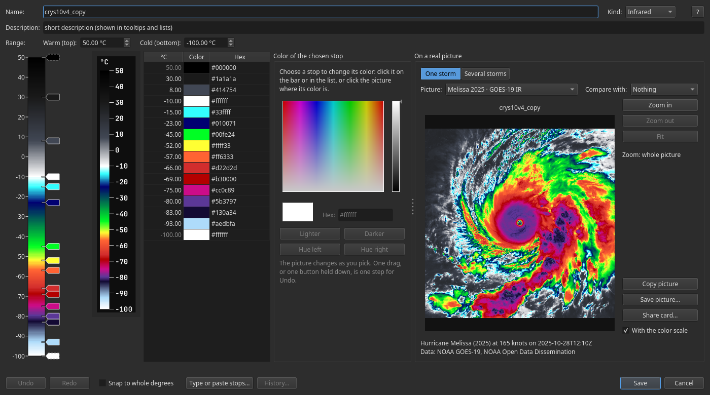
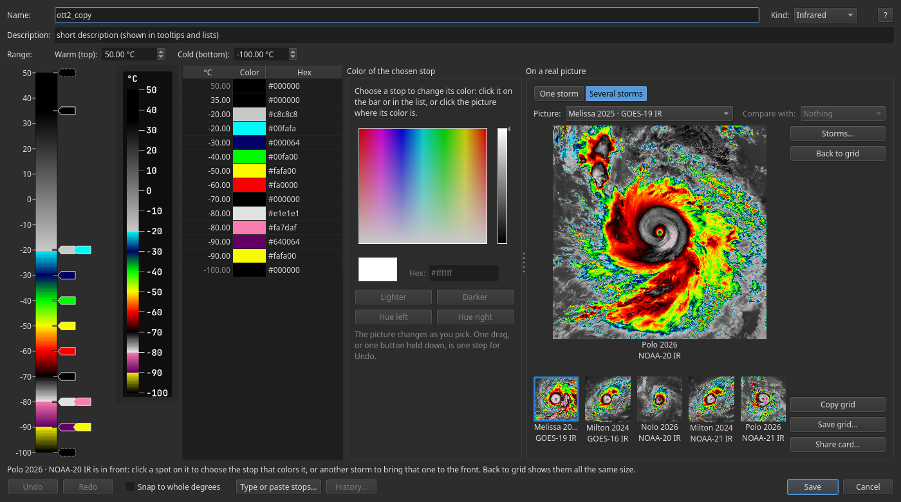
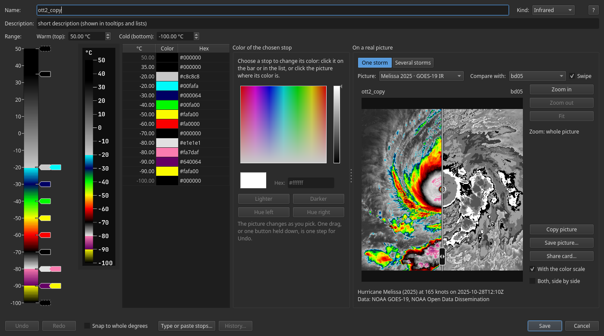
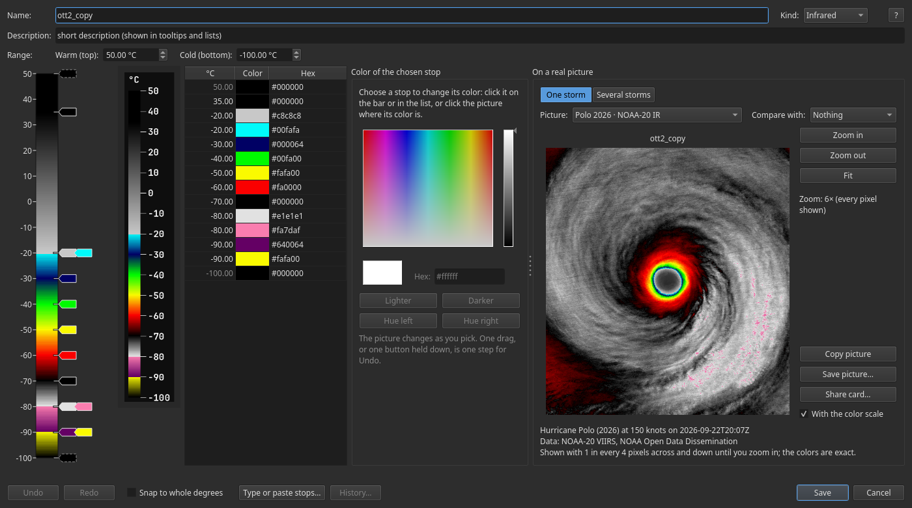
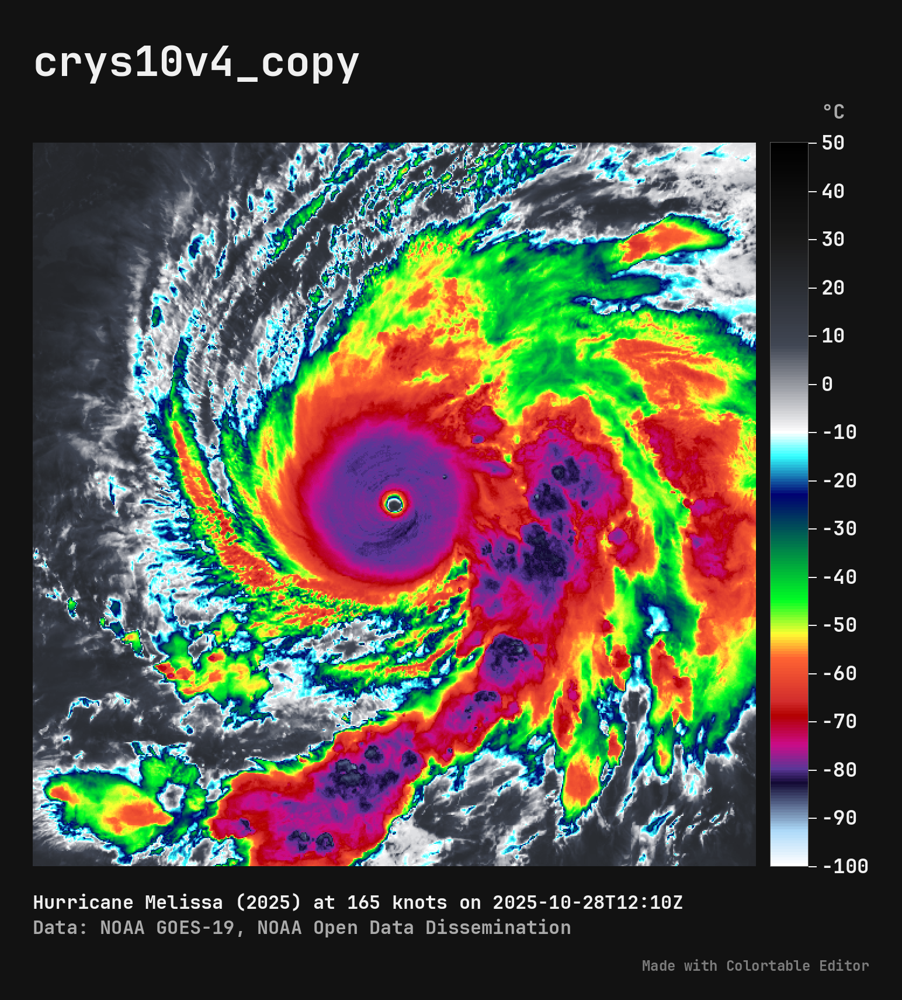
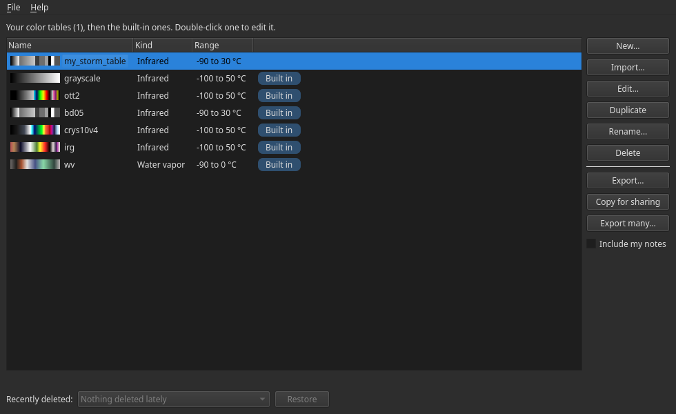

# Colortable Editor

Make and change infrared and water-vapor color tables on real storm pictures, and share them.

Colortable Editor is a free program for Windows and Linux. You build an infrared or
water-vapor color table stop by stop, and see it on a real storm as you go: the cold cloud
tops around an eye, the rain bands, the dry slots in water vapor. When you like it, send it
to a friend as a file or as a few lines of text to paste.

It works offline: it never connects to the internet, needs no account, and keeps everything
on your own computer.



## What it can do

**Build a table on a real storm.** The program comes with 32 real satellite pictures of
storms (below). Point at the picture to read the temperature there, and click it to choose
the stop that colors that spot.

**Try it on several storms at once.** Several storms shows your table on the storms you
choose, every one changing as you edit. Click one to bring it to the front.



**Compare two tables.** Compare with puts another table beside yours, or, with Swipe ticked,
on the same picture: drag the line across to see where they differ.



**Look up close.** Zoom in to see every pixel: the VIIRS pictures have 375-meter pixels.



**Share it.** Share card… makes one picture to post: your table's name, its color scale and
the storm drawn with it. Copy for sharing and Export… send the table itself, and Import…
brings in the ones your friends send.



**Never lose your work.** Each save keeps the version it replaces (History…), deleted tables
can be restored, and changes you hadn't saved are offered back if the program closes
unexpectedly.



## Download

Get the newest version from the [Releases page](https://github.com/OneFortyTwoK/colortable-editor/releases). It runs on 64-bit
Windows 10 and 11, and on 64-bit Linux from about 2022 on (Ubuntu 22.04, Debian 12, Fedora 36,
Linux Mint 21 or newer).

### Windows

1. Download `ColortableEditor-Windows.zip`.
2. Right-click it, choose **Extract All…**, pick where it should go (Documents, say) and
   click **Extract**.
3. Open the new `ColortableEditor` folder and double-click **ColortableEditor.exe**.

**Extract it first.** Windows can open a zip like a folder, but the program won't start from
inside one: it can't find its own files there.

The program isn't signed, so Windows may say **"Windows protected your PC"**. Click
**More info**, then **Run anyway**. Windows asks only the first time.

Keep the `_internal` folder beside `ColortableEditor.exe`: it holds the program's own files and the
sample storms. Nothing is installed. To start it from the desktop, right-click
`ColortableEditor.exe` and choose **Send to → Desktop (create shortcut)**. For a new version, delete
the old folder and extract the new zip; your own tables are kept elsewhere (below), so they
stay.

### Linux

1. Download `ColortableEditor-x86_64.AppImage`.
2. Mark it executable: right-click it, choose **Properties**, then **Permissions**, and
   tick **Allow executing file as program**. (Or, in a terminal:
   `chmod +x ColortableEditor-x86_64.AppImage`.)
3. Double-click it.

If it won't start, open a terminal in its folder and run
`./ColortableEditor-x86_64.AppImage --appimage-extract-and-run`.

For a new version, replace the old AppImage with the new one; your own tables are kept
elsewhere (below), so they stay.

## How to use

**The list.** The main window lists your own color tables first, then the built-in ones. A built-in table can't be changed, but you can copy it and change the copy.

**Making a table.** Press New… for a table of your own, or choose a built-in table and press Duplicate (or Edit…, which opens a copy of it in the editor). Infrared tables are for pictures of cloud-top temperature; water-vapor tables are for water-vapor pictures.

**In the editor.** The bar on the left is the table, warm at the top and cold at the bottom. Click the bar to add a stop, and drag a stop to move it. Choose a stop's color in the color panel. Right-click a stop to make a hard step or to delete it. Undo and Redo take back or redo any change. The ? button at the top right of the editor shows these tips while you work.

**The picture.** The picture is a real storm drawn with your table as you work. Choose another one in the Picture box. Point at the picture to read its temperature; click it to choose the stop that colors that spot. Compare with shows another table beside yours. Tick Swipe to put both on one picture instead, yours left of a line and the other right of it, and drag the line across to see where they differ. Copy picture and Save picture… keep the whole picture in your table (or, with Swipe ticked, split where the line is).

**Several storms at once.** Press Several storms, above the picture, to see your table on several storms at once, all changing as you edit; One storm goes back to the one picture. Storms… chooses the storms: at first, the first six of your table's kind are ticked, and what you tick is kept for next time, as is the view you leave the editor in. The storms of the other kind (water vapor, for an infrared table) are listed after them. Click a storm to bring it to the front: it gets big, the others go small beside it and keep changing as you edit, and Back to grid shows them all the same size again. The storm in front works like the one picture: point at it to read its temperature, click it to choose the stop that colors that spot, Shift-click to add a stop there, and scroll to zoom in. Double-click it to see it on its own. Copy grid and Save grid… keep the storms shown as one picture with the table's color scale, and Share card… makes a card of them to post.

**More room for the picture.** Drag the divider between the color panel and the picture to the left to fold the color panel away; drag it back, or double-click it, to bring the panel back. The windows open the size you leave them. View → Reset window layout (or Reset layout under the editor's ? button) puts them back as they first opened.

**Saving and sharing.** Save keeps the table. Export… writes the chosen table to a file, and Copy for sharing puts it on the clipboard, ready to paste into a message. Import… brings in tables a friend sent you, as files or as pasted text. In the editor, Share card… makes one picture to post: the table's name, its color scale and the storm drawn with it, with the storm's title and data line under it. Change the title if you like, then copy the card or save it as a PNG file. While you compare two tables, the card shows both, side by side or swiped as they are on screen.

**Earlier versions.** Each time you save over one of your tables, the version it replaces is kept, the last 20 of them. In the editor, press History… (or right-click a table in the list and choose History…) to see them, newest first, with their colors and range. Choose one and press Restore this version (Open in the editor, from the list) to put it back in the editor; press Save to keep it, or Undo to take it back out.

**Taking something back.** Deleted a table by mistake? Choose it under Recently deleted and press Restore. Its earlier versions come back with it.

**If the program closes unexpectedly.** While a table in the editor has changes you haven't saved, a copy of them is kept a moment after each change. If the program closes before you save (it crashes, or the computer loses power), it offers those tables back the next time it starts: Open puts one back in the editor with your changes, ready to save; Discard throws the changes away; Decide later asks again next time.

**Help → How to use** in the program says the same.

## Where your tables are kept

| System | Folder |
|---|---|
| Windows | `%APPDATA%\Colortable Editor` (for example `C:\Users\you\AppData\Roaming\Colortable Editor`) |
| Linux | `~/.config/Colortable Editor` |

Your tables are in `colortables.json` in that folder, your starred tables in `favorite_palettes.json`, the recently deleted ones in `colortables.deleted.json`, the earlier versions of your tables (History) in `colortables.history.json`, and how you left the windows (their size, whether the color panel is folded away, one storm or several, and the storms ticked under Storms…) in `layout.json`. Changes not yet saved wait in the `drafts` folder there while a table is open in the editor, and until you save or discard them if the program closed unexpectedly.
**Help → How to use** shows the exact folder. Nothing is saved anywhere else.

To keep your tables somewhere else (on a USB stick, say), set the environment variable
`COLORTABLE_EDITOR_CONFIG_DIR` to that folder before you start the program.

## Sharing tables

- **Copy for sharing** puts the chosen table on the clipboard as a few lines of text.
  Paste it into a message, a forum post or a chat.
- **Export…** saves the chosen table to a file you can send, and **Export many…** saves
  several tables in one file.
- **Import…** brings tables in: files a friend sent, or text they pasted. It also reads GMT
  `.cpt` files, MetPy `.tbl` files and plain lists of colors.

## The sample storms

The program comes with 32 real satellite pictures of storms to try your tables on, each the 13-degree box around the storm. Choose one in the editor's **Picture** box.

**Infrared:**

- **Hurricane Melissa (2025) at 165 knots on 2025-10-28T12:10Z** (Atlantic; GOES-19 ABI, 2.3 km pixels)
- **Hurricane Polo (2026) at 150 knots on 2026-09-22T20:07Z** (East Pacific; NOAA-20 VIIRS, 375 m pixels)
- **Hurricane Milton (2024) at 155 knots on 2024-10-07T20:00Z** (Atlantic; GOES-16 ABI, 2.6 km pixels)
- **Hurricane Nolo (2026) at 135 knots on 2026-09-28T12:09Z** (Central Pacific; NOAA-20 VIIRS, 375 m pixels)
- **Hurricane Milton (2024) at 155 knots on 2024-10-07T19:19Z** (Atlantic; NOAA-21 VIIRS, 375 m pixels)
- **Hurricane Polo (2026) at 125 knots on 2026-09-22T08:03Z** (East Pacific; NOAA-21 VIIRS, 375 m pixels)
- **Super Typhoon Haiyan (2013) at 170 knots on 2013-11-07T16:19Z** (West Pacific; S-NPP VIIRS, 375 m pixels)
- **Super Typhoon Haiyan (2013) at 165 knots on 2013-11-07T13:49Z** (West Pacific; Terra MODIS, 1.0 km pixels)
- **Super Typhoon Yutu (2018) at 155 knots on 2018-10-24T12:31Z** (West Pacific; GCOM-C SGLI, 250 m pixels)
- **Super Typhoon Nepartak (2016) at 150 knots on 2016-07-06T04:50Z** (West Pacific; Aqua MODIS, 1.0 km pixels)
- **Cyclone Mocha (2023) at 135 knots on 2023-05-13T19:52Z** (North Indian Ocean; NOAA-20 VIIRS, 375 m pixels)
- **Cyclone Narelle (2026) at 95 knots on 2026-03-18T15:22Z** (South Pacific; NOAA-21 VIIRS, 375 m pixels)
- **Hurricane Genevieve (2026) at 140 knots on 2026-07-27T08:40Z** (East Pacific; GOES-18 ABI, 2.6 km pixels)
- **Hurricane Lala (2026) at 115 knots on 2026-08-19T05:20Z** (Central Pacific; GOES-18 ABI, 3.0 km pixels)
- **Cyclone Alfred (2025) at 105 knots on 2025-02-28T03:00Z** (South Pacific; Himawari-9 AHI, 2.5 km pixels)
- **Cyclone Bheki (2024) at 115 knots on 2024-11-17T13:04Z** (South Indian Ocean; Meteosat-9 SEVIRI, 3.9 km pixels)
- **Typhoon Lan (2023) at 70 knots on 2023-08-13T08:50Z** (West Pacific; Himawari-9 AHI, 2.9 km pixels)
- **Hurricane Alex (2016) at 75 knots on 2016-01-14T14:10Z** (Atlantic; Meteosat-10 SEVIRI, 5.1 km pixels)
- **Hurricane Linda (2021) at 80 knots on 2021-08-17T10:21Z** (East Pacific; S-NPP VIIRS, 375 m pixels)
- **Hurricane Danielle (2022) at 75 knots on 2022-09-04T15:30Z** (Atlantic; GOES-16 ABI, 4.3 km pixels)
- **Hurricane Danielle (2022) at 75 knots on 2022-09-04T16:00Z** (Atlantic; NOAA-20 VIIRS, 375 m pixels)
- **Hurricane Linda (2021) at 75 knots on 2021-08-17T04:00Z** (East Pacific; GOES-17 ABI, 2.4 km pixels)
- **Hurricane Pablo (2019) at 70 knots on 2019-10-27T15:11Z** (Atlantic; Meteosat-11 SEVIRI, 6.5 km pixels)
- **Tropical Storm Rachel (2026) at 60 knots on 2026-09-30T00:00Z** (East Pacific; GOES-18 ABI, 2.9 km pixels)
- **Hurricane Katrina (2005) at 150 knots on 2005-08-28T17:45Z** (Atlantic; GOES-12 Imager, 4.5 km pixels)
- **Tropical Storm Elida (2026) at 55 knots on 2026-07-17T03:40Z** (East Pacific; GOES-18 ABI, 2.4 km pixels)
- **Tropical Depression Five (2026) at 30 knots on 2026-08-31T18:00Z** (Atlantic; GOES-19 ABI, 2.9 km pixels)
- **Remnant Low Fausto (2026) at 30 knots on 2026-07-29T20:30Z** (Central Pacific; GOES-18 ABI, 2.7 km pixels)

**Water vapor:**

- **Hurricane Melissa (2025) at 165 knots on 2025-10-28T12:00Z** (Atlantic; GOES-19 ABI, 2.3 km pixels)
- **Hurricane Milton (2024) at 135 knots on 2024-10-09T12:00Z** (Atlantic; GOES-16 ABI, 2.6 km pixels)
- **Hurricane Genevieve (2026) at 115 knots on 2026-07-26T18:40Z** (East Pacific; GOES-18 ABI, 2.7 km pixels)
- **Hurricane Lowell (2026) at 130 knots on 2026-09-02T12:00Z** (Central Pacific; GOES-18 ABI, 2.3 km pixels)

Sample pictures: NOAA GOES, JMA Himawari-9 (Lan 2023, Alfred 2025), and NOAA-20, NOAA-21 and Suomi NPP VIIRS, from NOAA Open Data Dissemination; GOES-12 (Katrina 2005) from NOAA NCEI's GridSat-GOES; EUMETSAT Meteosat-9, Meteosat-10 and Meteosat-11 SEVIRI (Bheki 2024, Alex 2016, Pablo 2019) from EUMETSAT's Data Store (contains modified EUMETSAT Meteosat data 2026); NASA Terra and Aqua MODIS and Suomi NPP VIIRS (Haiyan 2013, Linda 2021) from NASA LAADS DAAC; GCOM-C SGLI (Yutu 2018) from JAXA G-Portal. Original data for this value added data product was provided by Japan Aerospace Exploration Agency.

## Build it yourself

You need [Python](https://www.python.org/downloads/) 3.12 or newer, and this folder
(the green **Code** button, then **Download ZIP**, or `git clone https://github.com/OneFortyTwoK/colortable-editor.git`).
In a terminal, in the folder:

```
python -m venv .venv
.venv\Scripts\activate            (on Windows)
source .venv/bin/activate          (on Linux)
pip install -r requirements.txt
python -m colortable_editor
```

To run the tests: `pip install pytest`, then `python -m pytest`.

To build the program the way the Releases page has it:

```
pip install pyinstaller==6.22.3
pyinstaller colortable_editor.spec --noconfirm
```

It makes the folder `dist/ColortableEditor/`, with `ColortableEditor.exe` inside on Windows; GitHub zips that
folder into `ColortableEditor-Windows.zip`. On Linux, `bash packaging/build_appimage.sh` then wraps it into
`ColortableEditor-x86_64.AppImage`. GitHub builds both the same way when a version is tagged
(`.github/workflows/release.yml`).

## License

Colortable Editor is free software under the MIT License (see [LICENSE](LICENSE)), made by
OneFortyTwoK. It is built with Qt (through PySide6), numpy, matplotlib, Pillow and others, and
saved pictures are lettered in JetBrains Mono: their licenses are in
[THIRD_PARTY_NOTICES.md](THIRD_PARTY_NOTICES.md).
